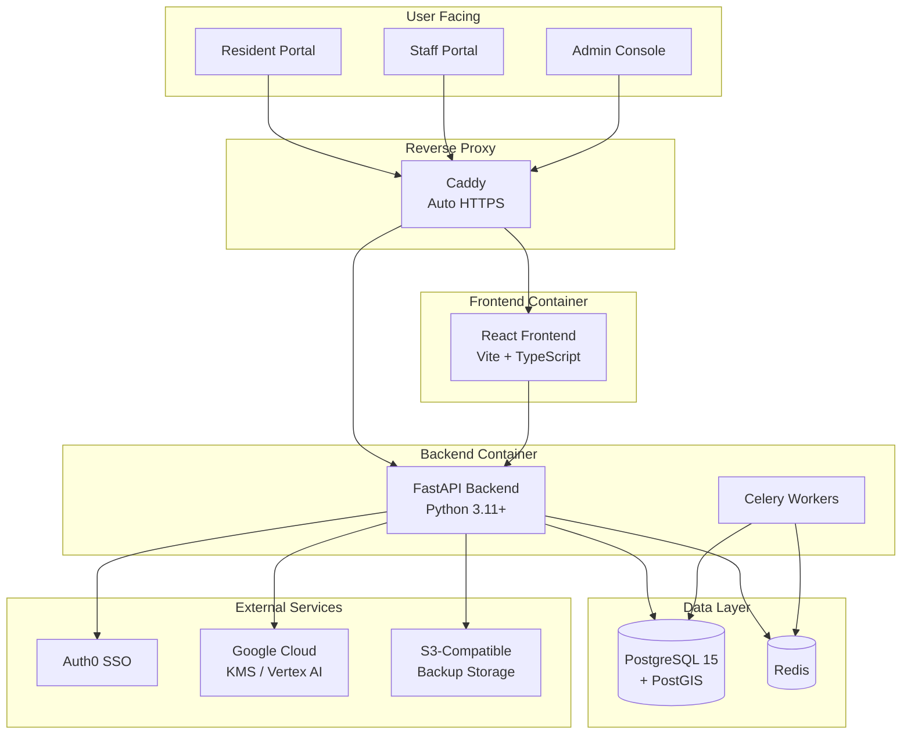
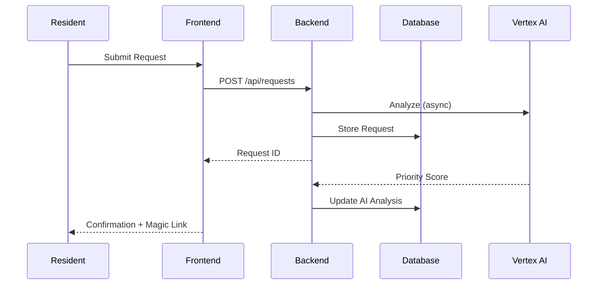
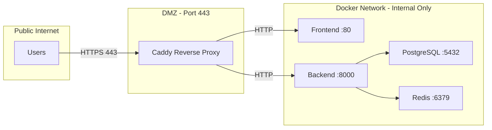

# System Architecture

This document provides a visual overview of Pinpoint 311's architecture for emergency contractors and new maintainers.

## Service Dependencies



## Data Flow



## Network Topology



## Container Restart Order

If manual restarts are needed:

| Order | Container | Command | Notes |
|-------|-----------|---------|-------|
| 1 | Database | `docker-compose restart db` | Only if absolutely needed |
| 2 | Redis | `docker-compose restart redis` | Cache will rebuild |
| 3 | Backend | `docker-compose restart backend` | API server |
| 4 | Frontend | `docker-compose restart frontend` | Static files |
| 5 | Caddy | `docker-compose restart caddy` | Renews certs |

## Key File Locations

| Component | Path | Purpose |
|-----------|------|---------|
| Docker Config | `/docker-compose.yml` | Container orchestration |
| Backend Code | `/backend/app/` | FastAPI application |
| Frontend Code | `/frontend/src/` | React application |
| API Routes | `/backend/app/api/` | Endpoint definitions |
| Database Models | `/backend/app/models/` | SQLAlchemy models |
| Migrations | `/backend/alembic/` | Schema migrations |

## Emergency Quick Reference

### Check All Services
```bash
docker-compose ps
```

### View Logs
```bash
docker-compose logs --tail=100 backend
docker-compose logs --tail=100 frontend
```

### Restart Everything (Safe)
```bash
docker-compose restart backend frontend redis caddy
```

### Database Connection
```bash
docker exec -it wwf-311-fix-db-1 psql -U postgres -d pinpoint311
```

### Create Backup
```bash
curl -X POST https://your-domain/api/system/backups/create \
  -H "Authorization: Bearer $ADMIN_TOKEN"
```

---

*Last Updated: February 2026*
